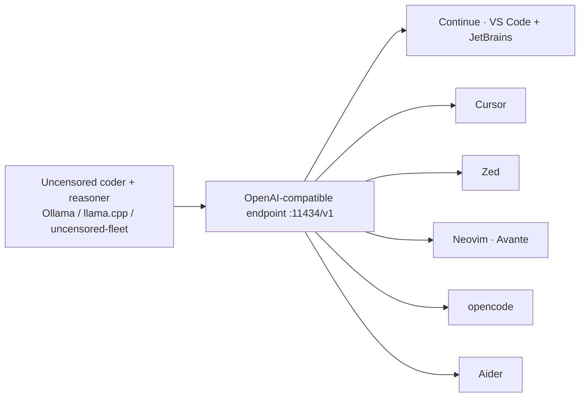

<a name="top"></a>
<div align="center">


# cognis-code

### One command → a **local, uncensored** AI coding suite wired into **every IDE**. No cloud, no keys, no limits.

[](LICENSE)   [](https://github.com/cognis-digital/cognis-neural-suite)

`#ai-coding` `#local-llm` `#uncensored` `#ollama` `#opencode` `#aider` `#continue` `#copilot-alternative`

</div>

Download once, point **VS Code, JetBrains, Cursor, Zed, Neovim, [opencode](https://github.com/sst/opencode), and Aider** at the same **local uncensored coder + reasoner**. A private, unrestricted Copilot you fully own.

## Usage — step by step

1. Install the CLI (console-script: `cognis-code`):
   ```bash
   pipx install "git+https://github.com/cognis-digital/cognis-code.git"
   cognis-code --version
   ```
2. Check your local setup and list the model roles it expects:
   ```bash
   cognis-code doctor
   cognis-code models
   ```
3. Pull a model (defaults to the `coder` role) and start the local OpenAI-compatible endpoint:
   ```bash
   cognis-code pull coder
   cognis-code serve            # serves on http://localhost:11434/v1
   ```
4. Wire an IDE/agent to that endpoint (use `all` to write every supported config). Preview first with `--dry-run`:
   ```bash
   cognis-code ide all --endpoint http://localhost:11434/v1 --dry-run
   cognis-code ide all
   ```
5. In CI, fail the job if the local setup is broken (`doctor` returns a non-zero exit on failure):
   ```bash
   cognis-code doctor || exit 1
   ```

## Install (every way)
```bash
pip install "git+https://github.com/cognis-digital/cognis-code.git"   # or pipx / uv tool install
curl -fsSL https://raw.githubusercontent.com/cognis-digital/cognis-code/main/install.sh | sh
docker run --rm ghcr.io/cognis-digital/cognis-code --help
```

## 30-second setup
```bash
cognis-code pull coder        # pull an uncensored coder (Ollama) — or use uncensored-fleet
cognis-code serve             # local OpenAI-compatible endpoint at :11434/v1
cognis-code ide all           # write configs for EVERY IDE/agent at once
# now open VS Code/Cursor/Zed/opencode — they're already on your local model
```

## Architecture


## What it wires up
| IDE / Agent | How |
|---|---|
| **VS Code · JetBrains** | writes `~/.continue/config.json` (Continue.dev) |
| **Cursor** | base-URL override snippet |
| **Zed** | `~/.config/zed/settings.json` assistant provider |
| **Neovim** | Avante/codecompanion config |
| **opencode** | `~/.config/opencode/opencode.json` local provider |
| **Aider** | `~/.aider.conf.yml` + local OpenAI base |

## Models (uncensored, swappable)
`coder` (Qwen2.5-Coder, abliterated) · `coder-big` (32B) · `reasoner` (DeepSeek-R1, abliterated) · `commander` (Josiefied-Qwen3-8B-abliterated). Powered by [uncensored-fleet](https://github.com/cognis-digital/uncensored-fleet) or plain Ollama.

## Related
[🤖 uncensored-fleet](https://github.com/cognis-digital/uncensored-fleet) · [🧠 engram](https://github.com/cognis-digital/engram) · [🔧 mcpify](https://github.com/cognis-digital/mcpify) · [🗂️ the suite](https://github.com/cognis-digital/cognis-neural-suite)

> ### ⭐ Star it — own your coding AI, uncensored and local.

## Responsible use
Local, unrestricted models are powerful. Use lawfully and ethically; you own what you generate.

## Interoperability

`cognis-code` composes with the 300+ tool Cognis suite — JSON in/out and a shared
OpenAI-compatible `/v1` backbone. See **[INTEROP.md](INTEROP.md)** for the
suite map, composition patterns, and reference stacks.

## Integrations

Forward `cognis-code`'s findings to STIX/MISP/Sigma/Splunk/Elastic/Slack/webhooks via
[`cognis-connect`](https://github.com/cognis-digital/cognis-connect). See **[INTEGRATIONS.md](INTEGRATIONS.md)**.

## License
COCL v1.0 — see [LICENSE](LICENSE).
