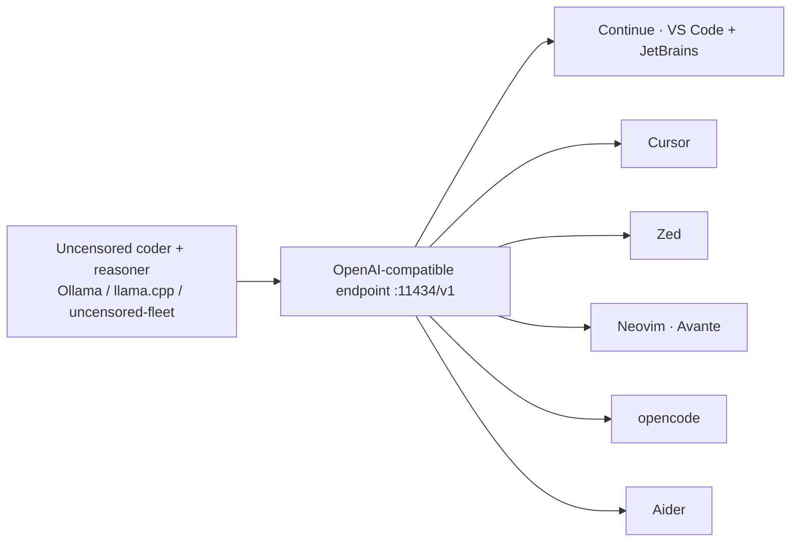

<a name="top"></a>
<div align="center">


# cognis-code

### One command → a **local, uncensored** AI coding suite wired into **every IDE**. No cloud, no keys, no limits.

[](LICENSE)   [](https://github.com/cognis-digital/cognis-neural-suite)

`#ai-coding` `#local-llm` `#uncensored` `#ollama` `#opencode` `#aider` `#continue` `#copilot-alternative`

</div>

Download once, point **VS Code, JetBrains, Cursor, Zed, Neovim, [opencode](https://github.com/sst/opencode), and Aider** at the same **local uncensored coder + reasoner**. A private, unrestricted Copilot you fully own.

<!-- cognis:layman:start -->
## What is this?

cognis-code is a command-line tool that connects a local AI model running on your own machine to popular code editors like VS Code, Cursor, Zed, and Neovim. Instead of sending your code to a cloud service, every AI suggestion stays entirely on your computer — nothing leaves your machine. You run one command to set it up, and your editor immediately gains an AI coding assistant powered by a locally running model you control. It is for developers who want AI code help without relying on subscriptions, internet access, or sharing their code with third-party servers.
<!-- cognis:layman:end -->

<!-- cognis:install:start -->
## Install

`cognis-code` is source-available (not published to PyPI) — every method below installs
straight from GitHub. Pick whichever you prefer; the one-line scripts auto-detect
the best tool available on your machine.

**One-liner (Linux / macOS):**
```sh
curl -fsSL https://raw.githubusercontent.com/cognis-digital/cognis-code/HEAD/install.sh | sh
```

**One-liner (Windows PowerShell):**
```powershell
irm https://raw.githubusercontent.com/cognis-digital/cognis-code/HEAD/install.ps1 | iex
```

**Or install manually — any one of:**
```sh
pipx install "git+https://github.com/cognis-digital/cognis-code.git"     # isolated (recommended)
uv tool install "git+https://github.com/cognis-digital/cognis-code.git"  # uv
pip install "git+https://github.com/cognis-digital/cognis-code.git"      # pip
```

**From source:**
```sh
git clone https://github.com/cognis-digital/cognis-code.git
cd cognis-code && pip install .
```

Then run:
```sh
cognis-code --help
```
<!-- cognis:install:end -->

## Install (every way)
```bash
pip install "git+https://github.com/cognis-digital/cognis-code.git"   # or pipx / uv tool install
curl -fsSL https://raw.githubusercontent.com/cognis-digital/cognis-code/main/install.sh | sh
docker run --rm ghcr.io/cognis-digital/cognis-code --help
```

## 30-second setup
```bash
cognis-code pull coder        # pull an uncensored coder (Ollama) — or use uncensored-fleet
cognis-code serve             # local OpenAI-compatible endpoint at :11434/v1
cognis-code ide all           # write configs for EVERY IDE/agent at once
# now open VS Code/Cursor/Zed/opencode — they're already on your local model
```

## Architecture


## What it wires up
| IDE / Agent | How |
|---|---|
| **VS Code · JetBrains** | writes `~/.continue/config.json` (Continue.dev) |
| **Cursor** | base-URL override snippet |
| **Zed** | `~/.config/zed/settings.json` assistant provider |
| **Neovim** | Avante/codecompanion config |
| **opencode** | `~/.config/opencode/opencode.json` local provider |
| **Aider** | `~/.aider.conf.yml` + local OpenAI base |

## Models (uncensored, swappable)
`coder` (Qwen2.5-Coder, abliterated) · `coder-big` (32B) · `reasoner` (DeepSeek-R1, abliterated) · `commander` (Josiefied-Qwen3-8B-abliterated). Powered by [uncensored-fleet](https://github.com/cognis-digital/uncensored-fleet) or plain Ollama.

<a name="verification"></a>
## Verification

[](AUDIT.md)

Every push is verified end-to-end. Latest audit (2026-06-13):

```text
tests        : 2 passed, 0 failed, 0 errored
compile      : all modules parse
cli          : cognis-code --help (see below)
package      : cognis_code
```

<details><summary>CLI surface (<code>--help</code>)</summary>

```text
usage: cognis-code [-h] [--version] {models,pull,serve,ide,doctor} ...

Local uncensored coding suite — one endpoint, every IDE.

positional arguments:
  {models,pull,serve,ide,doctor}
    models              list local model roles
    pull                pull a model via Ollama
    serve               serve the local OpenAI-compatible endpoint
    ide                 write config for an IDE/agent (or 'all')
    doctor              check the local setup
```
</details>

Full machine-readable results: [`AUDIT.md`](AUDIT.md) · regenerate with `cognis-code --help` + `pytest -q`.

<div align="right"><a href="#top">↑ back to top</a></div>


## Related
[🤖 uncensored-fleet](https://github.com/cognis-digital/uncensored-fleet) · [🧠 engram](https://github.com/cognis-digital/engram) · [🔧 mcpify](https://github.com/cognis-digital/mcpify) · [🗂️ the suite](https://github.com/cognis-digital/cognis-neural-suite)

> ### ⭐ Star it — own your coding AI, uncensored and local.

## Responsible use
Local, unrestricted models are powerful. Use lawfully and ethically; you own what you generate.

## License
COCL v1.0 — see [LICENSE](LICENSE).
